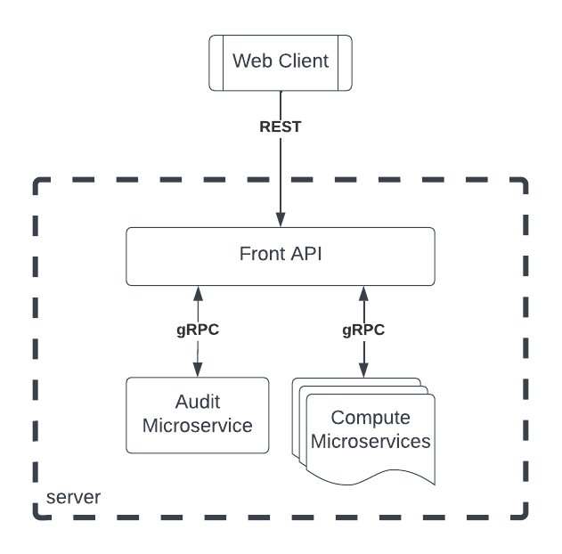

# Getting Started

### What is this for?
This is a simple web application that provides few RESTful APIs and internally 
delegates the execution to another microservices.

This project is a simple demo on using [Sprint Boot](https://spring.io/projects/spring-boot) REST controllers 
with [gRPC](https://grpc.io/) calls.

### Topology
There are three applications
- Front API: a spring boot server application with gRPC clients
- Audit Microservice: a java application with gRPC server for auditing requests
- Compute Microservices: a set of java application each acts as gRPC server for compute requests  



### Building the project
The following commands generates executable jars
```
./gradlew front-api:bootJar
./gradlew micro-a-replica:jar
./gradlew micro-b:jar
``` 

### Running the system
Run each of the following commands at separate terminals in any arbitrary order
```
# starting 3 compute microservices at ports 50051, 50052 and 50053 
java -jar micro-a-replica/build/libs/micro-a-replica-plain.jar 50051
java -jar micro-a-replica/build/libs/micro-a-replica-plain.jar 50052
java -jar micro-a-replica/build/libs/micro-a-replica-plain.jar 50053

# starting audit microservice at port 50060
java -jar micro-b/build/libs/micro-b-plain.jar 50060

# starting REST APIs server at port 8080 and connected to the microservices
java -jar -Dserver.port=8080 front-api/build/libs/front-api.jar localhost:50060 localhost:50051,localhost:50052,localhost:50053
```

### REST APIs
The following REST APIs are provided by the front server

`/network`  this API just prints the network configurations. It is for debugging purposes to make sure the API server 
is up and running
```
curl 'http://localhost:8080/network'
Connected to Audit microservice at localhost:50060. Connected to 3 Compute microservices at [localhost:50051, localhost:50052, localhost:50053]
```

`/calculate` do a simple computation by adding the two given parameters x and y. The computation itself does not occur 
on the API server but it is being submit to all the compute microservices using gRPC call, then we return the results 
recevied from the fastest microservice.
After the computation is performed, another gRPC is performed to the audit microservice to store some request metadata 

P.S. there is a random delay (less than 2 seconds) is added at each compute microservice to avoid returning the results 
from the same compute node each time     
```
curl 'http://localhost:8080/calculate?x=15&y=7'
22
```

`/history` returns a list of computation requests received so far. The history is stored at the audit microservice, and 
is retrieved from it using another gRPC call. Each record in the array returned contains a timestamp, computed results,
and the fastest computation node responded, and the response time in milliseconds.
```
curl 'http://localhost:8080/history'
[
"1668193127226: received '22' from 'compute@50051' in 527 millis",
"1668193095668: received '1' from 'compute@50052' in 678 millis",
"1668193075461: received '5' from 'compute@50051' in 1454 millis",
"1668193064435: received '30' from 'compute@50053' in 856 millis"
]
```

### gRPC
The following is the definition for the protobuff messages
#### Compute microservice
```
syntax = "proto3";
import "base.proto";
option java_package = "com.simple.compute";

service Computer {
  rpc compute (ComputationInput) returns (ComputationResult) {}
}

message ComputationInput {
  OPERATOR operator = 1;
  int32 x = 2;
  int32 y = 3;
}
message ComputationResult {
  string id = 1;
  int32 result = 2;
}
```
#### Audit microservice
```
syntax = "proto3";
import "base.proto";
option java_package = "com.simple.audit";

service Auditor {
  rpc audit (AuditInput) returns (AuditResult) {}
  rpc history (HistoryInput) returns (stream HistoryResult) {}
}

message AuditInput {
  string id = 1;
  int64 responseTime = 2;
  int32 result = 5;
  int64 timestamp = 6;
}
message AuditResult {
  bool success = 1;
}

message HistoryInput {
  int32 maxResult = 1;
}
message HistoryResult {
  int64 timestamp = 1;
  string record = 2;
}
```

### Guides
The following guides illustrate how to use some features concretely:
* [Building a RESTful Web Service](https://spring.io/guides/gs/rest-service/)
* [Using gRPC for interprocess communications](https://www.tutorialspoint.com/grpc/index.htm)
